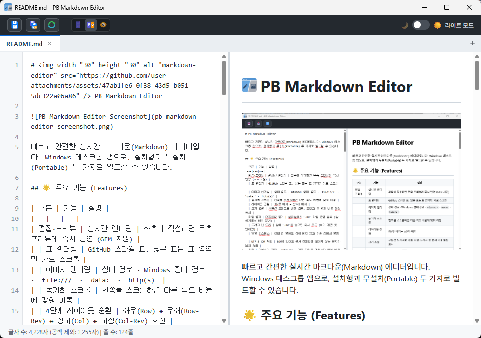

#  PB Markdown Editor



빠르고 간편한 실시간 마크다운(Markdown) 에디터입니다. Windows 데스크톱 앱으로, 설치형과 무설치(Portable) 두 가지로 빌드할 수 있습니다.

## 🌟 주요 기능 (Features)

| 구분 | 기능 | 설명 |
|---|---|---|
| 편집·프리뷰 | 실시간 렌더링 | 좌측에 작성하면 우측 프리뷰에 즉시 반영 (GFM 지원) |
| | 표 렌더링 | GitHub 스타일 표. 넓은 표는 표 영역만 가로 스크롤 |
| | 이미지 렌더링 | 상대 경로 · Windows 절대 경로 · `file:///` · `data:` · `http(s)` |
| | 동기화 스크롤 | 한쪽을 스크롤하면 다른 쪽도 비율에 맞춰 이동 |
| | 4단계 레이아웃 순환 | 좌우(Row) ↔ 우좌(Row-Rev) ↔ 상하(Col) ↔ 하상(Col-Rev) 회전 |
| | 3단계 뷰 모드 | `[에디터]`, `[에디터, 프리뷰]`, `[프리뷰]` 전환 (단일 모드 시 회전 버튼 비활성화) |
| | 크기 조절 | 구분선 드래그로 비율 조절, 드래그 중 현재 비율 툴팁 표시 |
| | 줄 번호 & 상태바 | 좌측 줄 번호 거터(스크롤·줄바꿈 연동) 및 상태바 실시간 글자/줄 수 카운터 |
| | 테마 스위치 | 다크 모드 🌙 ↔ 라이트 모드 ☀️ 실시간 전환 및 `localStorage` 영구 유지 |
| | 컬러 SVG 툴바 | 직관적인 고화질 컬러 SVG 아이콘(레이아웃, 저장, 다른이름저장, 뷰모드 3종) 탑재 |
| 다중 탭 & 파일 | 멀티탭 문서 관리 | 새 탭(`Ctrl+T`), 탭 순환(`Ctrl+Tab`), 닫기(`Ctrl+W`), 드래그 앤 드롭 시 우측 끝 탭 추가 |
| | 외부 파일 실시간 감지 | 외부에서 문서 수정 시 3초 디바운스 후 1회 자동 갱신 (자가 저장 루프 방지) |
| | 더블클릭 열기 | 설치형에서 `.md` 파일 연결 등록 (탐색기에서 바로 새 탭으로 열기) |
| | 드래그 앤 드롭 | 창에 `.md`를 놓으면 우측 끝에 탭 추가 및 포커스 |
| | 단일 인스턴스 | 여러 번 열어도 창이 늘지 않고 기존 창의 새 탭으로 열림 |
| | UTF-8 BOM 처리 | BOM이 있어도 문서 첫머리에 보이지 않는 문자가 남지 않음 |
| 저장 | 덮어쓰기 저장 | `Ctrl+S` — 기존 파일은 대화상자 없이 바로 저장 |
| | 다른 이름으로 저장 | `Ctrl+Shift+S` — 항상 저장 대화상자 표시 |
| | 수정 상태 표시 | 탭 및 창 제목에 파일명과 미저장 표시 (`*README.md - PB Markdown Editor`) |
| | 닫기 전 확인 | 미저장 상태로 탭/앱을 닫거나 교체할 때 저장/저장 안 함/취소 확인 |
| 보안 | 프로세스 분리 | `contextIsolation` 적용. 파일 입출력은 메인 프로세스만 수행 |
| | 접근 범위 제한 | 파일 접근을 `.md` / `.markdown` 확장자로 한정 |
| | HTML 살균 | DOMPurify 적용. 이미지용 `file:`은 허용하되 링크에서는 차단 |

### ⌨️ 단축키

| 단축키 | 동작 |
|---|---|
| `Ctrl + S` | 저장 (기존 파일은 대화상자 없이 덮어쓰기) |
| `Ctrl + Shift + S` | 다른 이름으로 저장 |
| `Ctrl + T` | 새 탭 추가 (우측 끝에 추가 및 즉시 포커스) |
| `Ctrl + Tab` | 다음 탭으로 이동 (순환 탐색) |
| `Ctrl + W` | 현재 활성 탭 닫기 (미저장 시 확인 대화상자) |

## 🚀 설치 및 실행 (Installation & Execution)

### 사전 요구 사항 (Prerequisites)

* [Node.js](https://nodejs.org/) **22.12 이상** — Electron 43이 요구하는 최소 버전입니다.
* Git
* Windows (빌드 타깃이 Windows 전용입니다)

### 설치 방법

1. 저장소를 클론(Clone)하거나 다운로드합니다.
```bash
git clone https://github.com/PEANUTBUTTER1001/pb-markdown-editor
cd pb-markdown-editor
```

2. 필요한 패키지를 설치합니다.
```bash
npm install
```

### 🚀 실행 및 빌드 방법 (3가지 방식)

사용 목적에 따라 3가지 방법으로 앱을 실행하거나 빌드할 수 있습니다.

#### 1. 개발자 모드 실행 (빠른 테스트용)

소스코드를 직접 수정하고 즉시 테스트해볼 때 사용합니다.
```bash
npm start
```
* `npm start`를 입력하면 자동으로 아이콘 생성(`make-icon.js`)과 코드 번들링(`esbuild`)이 수행된 후 앱이 실행됩니다.

#### 2. 설치형(Installer) 빌드 (추천 - 가장 빠른 실행 속도)

사용자 PC에 정식으로 설치하는 방식입니다. 초기 실행 속도가 매우 빠릅니다.
```bash
npm run build:installer
```
* 빌드가 완료되면 `dist/` 폴더 내에 `PB Markdown Editor Setup 1.1.0.exe` 형태의 설치 파일이 생성됩니다.
* 이 파일을 배포하여 사용자가 설치하게 하면, 이후 바탕화면 아이콘 클릭 시 즉시 켜지는 극강의 로딩 속도를 제공합니다.
* 설치 경로를 사용자가 직접 고를 수 있습니다.

#### 3. 단일 실행 파일(Portable) 빌드 (무설치 버전)

설치 과정 없이 파일 하나만 들고 다니며 즉시 실행하고 싶을 때 사용합니다.
```bash
npm run build:portable
```
* 빌드가 완료되면 `dist/` 폴더 내에 `PB Markdown Editor 1.1.0.exe` 파일이 생성됩니다.
* 실행 시 매번 임시 폴더에 압축을 푸는 과정이 있어 설치형에 비해 초기 로딩 시간이 몇 초 정도 더 걸립니다.
* ⚠️ **`.md` 파일 연결(더블클릭으로 열기)은 설치형에서만 등록됩니다.** 무설치 버전은 Windows 레지스트리에 확장자를 등록하지 않으므로, 파일 연결이 필요하면 설치형을 사용하세요. 무설치 버전에서도 앱을 먼저 실행한 뒤 파일을 창에 드래그 앤 드롭하면 열 수 있습니다.

## 💻 사용법 (Usage)

1. 프로그램이 실행되면 화면 좌측(또는 상단)의 텍스트 에디터 창에 마크다운 문법으로 글을 작성합니다.
2. 실시간으로 우측(또는 하단)에 결과가 렌더링됩니다.
3. 기존 문서를 열려면 `.md` 파일을 창 안으로 드래그하거나, (설치형 한정) 탐색기에서 더블클릭합니다.
4. 상단의 **레이아웃 전환(Layout)** 아이콘 버튼을 클릭하면 패널 배치를 4방향으로 순환 변경할 수 있습니다.
5. 상단 우측의 **뷰 모드(에디터 / 분할 / 프리뷰)** 아이콘 버튼으로 원하는 작업 화면만 선택해 집중할 수 있습니다.
6. 패널 사이의 경계선을 드래그하면 에디터와 프리뷰 영역의 크기를 조절할 수 있습니다.
7. 작성을 완료한 후 상단의 **저장(Save, `Ctrl+S`)** 아이콘 버튼을 누르면 저장됩니다. 이미 파일을 열었거나 한 번 저장한 문서는 대화상자 없이 바로 덮어쓰기되고, 새 문서는 저장 위치를 묻습니다.
8. 다른 위치·이름으로 저장하려면 **다른 이름으로 저장(Save As, `Ctrl+Shift+S`)** 아이콘 버튼을 사용합니다.

### 🖼️ 이미지 경로 규칙

프리뷰의 이미지 상대 경로는 **현재 열려 있는 `.md` 파일이 있는 폴더**를 기준으로 해석됩니다.

```markdown
     <!-- .md 파일과 같은 폴더의 images/ -->
           <!-- 상위 폴더의 assets/ -->
      <!-- Windows 절대 경로도 가능 -->
```

* Windows 절대 경로, `file:///` URL, `data:` URI, 원격 `http(s)` 이미지를 모두 지원합니다.
* 경로에 한글이나 공백이 있어도 정상 표시됩니다.
* ⚠️ **아직 저장하지 않은 새 문서에서는 상대 경로를 해석할 기준 폴더가 없어 이미지가 표시되지 않습니다.** 문서를 한 번 저장하면 그때부터 저장한 위치를 기준으로 표시됩니다.

## 📄 라이선스 (License)

[ISC](LICENSE)
